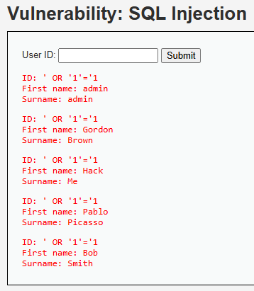

# Auditoría de Seguridad: Inyección SQL (SQLi)

## 1. Evidencia del Ataque
El ataque se ejecutó en el módulo "SQL Injection" del entorno DVWA (nivel de seguridad: Low). Se utilizó el siguiente *payload* en el campo de entrada de ID de usuario:

`' OR '1'='1`

---

## 2. Explicación Técnica (Por qué funciona)
La vulnerabilidad existe porque la aplicación concatena directamente la entrada del usuario dentro de la consulta SQL sin sanitizarla ni utilizar consultas preparadas (Prepared Statements). 

El código vulnerable en el backend de la aplicación probablemente luce así:
`SELECT first_name, last_name FROM users WHERE user_id = '$id';`

Al introducir el payload `' OR '1'='1`, la consulta final interpretada por el motor de la base de datos se transforma en:
`SELECT first_name, last_name FROM users WHERE user_id = '' OR '1'='1';`

**Análisis lógico:**
* La primera comilla simple (`'`) cierra prematuramente la cadena de texto que el programador esperaba recibir.
* El operador `OR` añade una segunda condición.
* La expresión `'1'='1'` es una tautología (siempre es verdadera).
* Como resultado, la base de datos ignora la verificación del ID y devuelve todos los registros de la tabla, saltándose los controles de acceso.

---

## 3. Severidad y Puntaje CVSS 3.1
Esta vulnerabilidad representa un riesgo crítico para la confidencialidad de los datos de SuperMax.

* **Puntaje Base:** 7.5 (Alto)
* **Vector CVSS:** `CVSS:3.1/AV:N/AC:L/PR:N/UI:N/S:U/C:H/I:N/A:N`

**Justificación de las métricas:**
* **Vector de Ataque (AV: Network):** El ataque se realiza remotamente a través del portal web de fidelización.
* **Complejidad (AC: Low):** No requiere condiciones especiales ni herramientas avanzadas; basta con un navegador web.
* **Privilegios Requeridos (PR: None):** Se puede explotar desde campos de entrada públicos (ej. formularios de inicio de sesión o búsqueda) sin necesidad de una cuenta previa.
* **Interacción del Usuario (UI: None):** El atacante no necesita que un cliente de SuperMax interactúe para ejecutar el ataque.
* **Alcance (S: Unchanged):** El impacto se limita a la base de datos vulnerada, sin comprometer otros componentes de infraestructura subyacente de forma inmediata.
* **Confidencialidad (C: High):** Se expone el 100% de la base de datos. Para SuperMax, esto significa la filtración masiva del PII (Información Personal Identificable) de los clientes, sus tarjetas de fidelización y el historial de compras minoristas.
* **Integridad (I: None) y Disponibilidad (A: None):** Este *payload* específico (`SELECT`) solo extrae datos, no los modifica ni tumba el servidor, aunque vectores de SQLi más avanzados podrían lograrlo.

---

## 4. Políticas y Controles de Seguridad

### Política de Prevención (Estratégico)
Debe establecerse la **Política de Desarrollo Seguro de Software**, haciendo obligatorio que cualquier interacción entre el código backend y la base de datos utilice exclusivamente **Consultas Parametrizadas (Prepared Statements)** o herramientas ORM (Object-Relational Mapping). Queda estrictamente prohibida la concatenación dinámica de cadenas (código *inline*) para interactuar con motores SQL.

### Control de Mitigación (Técnico)
Como medida correctiva inmediata en el portal de SuperMax:
1.  **Validación de Entrada (Input Validation):** Implementar listas blancas (*allow-listing*) en el frontend y backend para asegurar que campos numéricos (como un ID) solo acepten números enteros.
2.  **Web Application Firewall (WAF):** Desplegar una regla en el WAF configurada para detectar y bloquear patrones conocidos de inyección SQL (como `OR 1=1`, `UNION SELECT`) antes de que la petición HTTP alcance el servidor web.
3.  **Principio de Menor Privilegio:** Asegurar que el usuario de base de datos que utiliza la aplicación web tenga permisos de solo lectura (`SELECT`) sobre las tablas estrictamente necesarias, evitando que un atacante pueda escalar para realizar `DROP TABLE` o inyectar comandos de sistema.