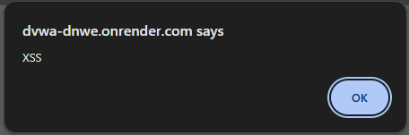

# Auditoría de Seguridad: Cross-Site Scripting (XSS Reflejado)

## 1. Evidencia del Ataque
El ataque se ejecutó en el módulo "XSS (Reflected)" del entorno DVWA (nivel de seguridad: Low). Se introdujo el siguiente *payload* en el campo de entrada de nombre:

``

*(Nota: Asegúrate de guardar la captura de pantalla mostrando la ventana emergente de alerta en el navegador).*

---

## 2. Explicación Técnica (Por qué funciona)
La vulnerabilidad de XSS Reflejado ocurre cuando una aplicación web recibe datos de una solicitud HTTP (por ejemplo, a través de parámetros en la URL) y los incluye inmediatamente en la respuesta HTML sin un proceso previo de validación o codificación segura.

En este escenario, el código PHP subyacente simplemente toma el valor del parámetro (ej. `$_GET['name']`) y lo imprime con un `echo`. Al inyectar etiquetas HTML y JavaScript puro (``) y restrinjan la carga de scripts externos únicamente a dominios autorizados y controlados por la empresa.