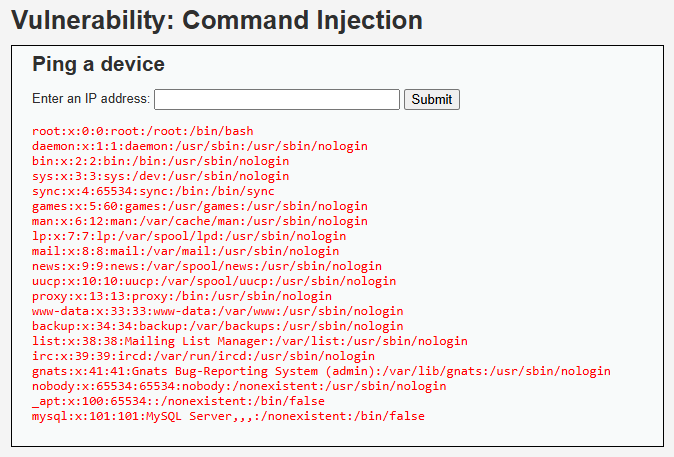

# Auditoría de Seguridad: Inyección de Comandos (Command Injection)

## 1. Evidencia del Ataque
El ataque se ejecutó en el módulo "Command Injection" del entorno DVWA (nivel de seguridad: Low). Se introdujo el siguiente *payload* en el campo de entrada destinado a hacer ping a una dirección IP:

[cite_start]`127.0.0.1; cat /etc/passwd` [cite: 33]

*(Nota: Asegúrate de guardar la captura de pantalla mostrando la salida del archivo passwd del sistema Linux).*

---

## 2. Explicación Técnica (Por qué funciona)
La inyección de comandos ocurre cuando una aplicación pasa datos no seguros (suministrados por el usuario) a un *shell* del sistema operativo (usando funciones como `system()`, `exec()` o `shell_exec()` en PHP) sin una validación estricta.

En este caso, la aplicación espera una dirección IP para ejecutar un comando `ping` a nivel de sistema. Sin embargo, al inyectar un punto y coma (`;`), que en sistemas basados en Unix actúa como un separador de comandos, el *shell* interpreta la instrucción como dos comandos distintos ejecutados secuencialmente:
1. `ping -c 4 127.0.0.1` (Se ejecuta de forma normal).
2. `cat /etc/passwd` (Se ejecuta inmediatamente después, leyendo un archivo sensible del sistema).

[cite_start]Esto demuestra que el atacante tiene la capacidad de ejecutar código arbitrario y toma control del servidor[cite: 33].

---

## 3. Severidad y Puntaje CVSS 3.1
Esta vulnerabilidad representa un riesgo de nivel Crítico, siendo la amenaza más grave para la infraestructura de SuperMax.

* **Puntaje Base:** 10.0 (Crítico)
* **Vector CVSS:** `CVSS:3.1/AV:N/AC:L/PR:N/UI:N/S:C/C:H/I:H/A:H`

**Justificación de las métricas:**
* **Vector de Ataque (AV: Network):** El ataque se realiza de forma remota desde internet.
* **Complejidad (AC: Low):** La explotación es directa usando caracteres separadores de comandos estándar (`;`, `&&`, `|`).
* **Privilegios Requeridos (PR: None):** Se ejecuta desde un campo accesible sin autenticación previa (dependiendo de la exposición del portal).
* **Interacción del Usuario (UI: None):** Completamente automatizable sin interacción de la víctima.
* **Alcance (S: Changed):** La vulnerabilidad en la aplicación web permite comprometer un componente distinto: el sistema operativo subyacente del servidor.
* **Confidencialidad, Integridad y Disponibilidad (C: High, I: High, A: High):** Un atacante obtiene control total del servidor web (Remote Code Execution - RCE). Para SuperMax, el impacto es devastador: el atacante no solo puede destruir o alterar el portal de fidelización, sino usar este servidor comprometido para realizar *pivoting* (movimiento lateral) hacia la red corporativa interna, llegando potencialmente a comprometer los sistemas de inventario y las cajas registradoras (POS), paralizando las ventas físicas.

---

## 4. Políticas y Controles de Seguridad

### Política de Prevención (Estratégico)
Se debe instaurar la política de **Prohibición de Ejecución Directa de Comandos de Sistema**. Las aplicaciones web nunca deben invocar directamente al *shell* del sistema operativo (ej. `cmd.exe` o `/bin/bash`). Si se requiere una funcionalidad de red (como un *ping*), se deben utilizar las API o librerías nativas del lenguaje de programación (ej. librerías de red en Java, C# o Node.js) que no interactúan con el intérprete de comandos.

### Control de Mitigación (Técnico)
Para contener el riesgo mientras se refactoriza el código de SuperMax:
1. **Validación Estricta de Formato (Regex):** Implementar una expresión regular en el backend que valide que el *input* tenga estrictamente el formato de una dirección IPv4 (cuatro octetos numéricos separados por puntos), rechazando cualquier otro carácter.
2. **Principio de Menor Privilegio (Hardening):** El servicio web (ej. `www-data` en Apache/Nginx) debe ejecutarse con los privilegios mínimos necesarios. No debe tener permisos para ejecutar utilidades binarias del sistema ni leer archivos fuera del directorio de la aplicación web.
3. **Segmentación de Red (DMZ):** Aislar el servidor web en una Zona Desmilitarizada (DMZ) estricta, con reglas de firewall que impidan cualquier conexión saliente desde este servidor hacia la red interna de cajas registradoras y bases de datos core del supermercado.